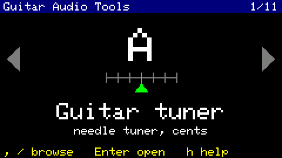
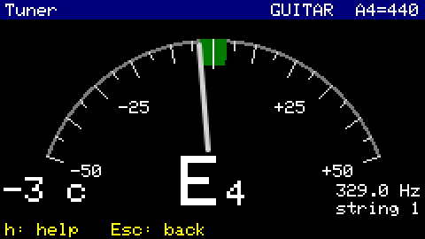
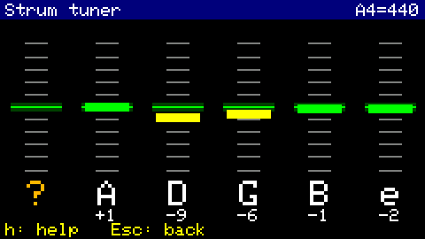
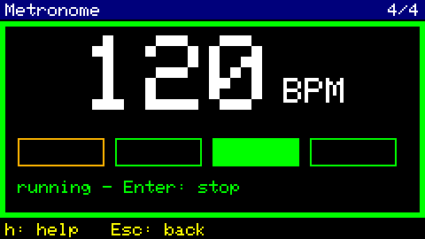
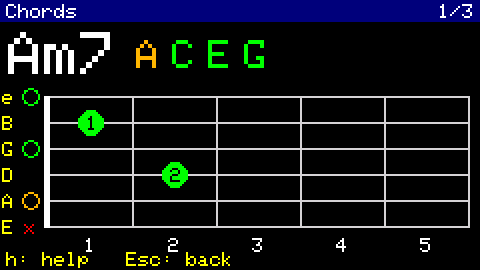
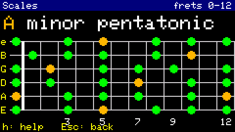
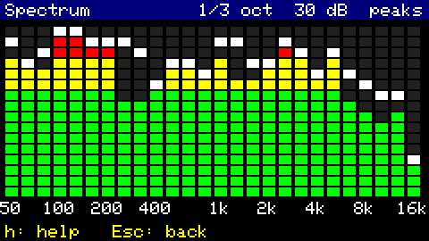
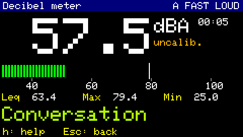

# Guitar Audio Tools for Cardputer ADV

Audio tools for guitarists and musicians on the M5Stack Cardputer ADV
(ESP32-S3): a precise tuner, a strum tuner for all six strings at once, BPM
detector, spectrum analyser, sound level meter and more.

**Supported devices: M5Stack Cardputer ADV and M5StickS3** (both have the
ES8311 audio codec; on the original Cardputer the microphone stays silent).
One source code, two builds: `pio run -e cardputer` and `pio run -e sticks3`. Install it from **M5Burner** (search "Guitar Audio
Tools") or from the firmware list of the Launcher, or build it yourself (below).

| | |
|---|---|
|  |  |
| Launcher: `,` `/` browse, `Enter` open | Guitar tuner: E4, 3 cents flat |
|  |  |
| Strum tuner: all six strings from one strum | Metronome: 4/4, the frame flashes on the beat |
|  |  |
| Chords: type `am7`, see the shape | Scales: A minor pentatonic on the neck |
|  |  |
| Spectrum: 26 third-octave bands | Decibel meter: dBA, Leq, Max, Min |

## M5StickS3
The same firmware also runs on the **M5StickS3** (same ES8311 codec and
microphone, ESP32-S3, 8 MB PSRAM, a 240 x 135 display in landscape):
`pio run -e sticks3 -t upload`. Differences:
- two buttons instead of the keyboard: **A** (front) click = main action,
  double click = action menu (the other functions of the app + Help),
  hold = back to the apps; **B** (right side) click = next, hold = previous;
- no Recorder (no SD card);
- Chords: A = next root, B = next shape, the menu changes the root and the
  chord type; Scales: A = next key, B = next scale;
- the speaker is set to the metronome's 44.1 kHz mono (the default 22050 Hz
  stereo played clicks twice now and then and up to 30 ms late) and the
  clicks ring longer (a smaller speaker);
- the microphone differs from the Cardputer's: recalibrate the Strum tuner
  and the decibel meter;
- automatic power-off after 5 minutes without a button press (a warning with
  a 10 s countdown first, any button cancels it; not while the metronome
  runs); power on with a short press of the left button, off with a double
  press.
Everything that differs is in `src/hw/board.*`.

## Apps
Version **1.1.0-beta.1** (shown on the launcher's help page `h` and printed on
the serial console at start). In the order of the launcher:

1. **Guitar tuner** – needle gauge ±50 cents, note name
2. **Strum tuner** – strum all six open strings, see which are out of tune
3. **Metronome** – clicks with accents, tempo from BPM or tapping
4. **BPM detector** – from music or by tapping (tap tempo)
5. **Chords** – chord dictionary: type a name, see the shape on the fretboard
6. **Scales** – scales on the whole fretboard
7. **Recorder** – WAV files on the SD card
8. **Intonation** – guitar setup: open string (or 12th-fret harmonic) vs. the
   12th fret, tells which way to move the saddle, overview of all 6 strings
9. **Spectrum analyser** – green/yellow/red bars (16 bars or third octaves)
10. **Decibel meter** – calibrated dB SPL, max, average (Leq), A-weighting
11. **Mic test** – diagnostics

The firmware is meant for musicians and guitarists. (A night/snoring monitor
was dropped for that reason. Checking guitar intonation up the neck needs no
extra app: the tuner in CHROMATIC mode shows any note and its deviation.
A vocal trainer was dropped too: the chord and scale reference fits better.)

Design and development order: [ARCHITECTURE.md](ARCHITECTURE.md).
Current state: all apps done and tested on the device (beta).

## Controls
Every app: `h` shows a help page with its keys (big, readable font), `Esc` goes
back to the launcher. The keys follow one scheme: `Enter` = the main action,
`,` / `/` (left/right) = change a mode or value, `;` / `.` (up/down) = microphone
gain (shown for 1.5 s as "MIC GAIN 27 dB", remembered per app). All text is white or coloured (no grey text: it is hard to read on the
small display).

- Launcher: `,` / `/` browse the apps (round in both directions), `Enter` opens
  one. After power-on the last opened app is selected (saved by its title).
- Decibel meter: `a` A/Z weighting, `Enter` (or `r`) reset Leq/Max/Min,
  `c` calibration (`;`/`.` ±0.5 dB, `,`/`/` ±5 dB, `Enter` saves, `c` cancels).
  Samples at 32 kHz; A-weighting follows IEC 61672 within 0.25 dB up to 8 kHz.
  Automatic range: codec gain 18 dB, switches to 0 dB for very loud sound.
  Time weighting Fast (1/8 s); the big number is rewritten twice per second
  like on real meters, the bar moves smoothly.
- Guitar tuner: `Enter` (or `m`) GUITAR / CHROMATIC mode, `,`/`/` reference pitch A4 −1/+1 Hz
  (430–450; when it is not 440, "A4 438" is shown big and orange at the top right in
  the tuner, Strum tuner and Intonation), `;`/`.` microphone gain. Needle ±50 cents, green centre ±3 cents.
  GUITAR mode always shows the nearest string of the standard tuning, even when
  it is more than a semitone off ("E −90, tune up"). Measured accuracy with
  tones from a laptop speaker (220/440/880 Hz): within ±0.15 cents.
  The needle moves only after 3 agreeing, clearly periodic readings (pluck noise
  is not shown); GUITAR mode searches 60–420 Hz only (no octave errors at the
  pluck); a sub-harmonic of the ringing note (low E resonating while the high E
  decays) is ignored; a new pluck (+6 dB) starts over. For 0.5 s after a
  pluck the needle is thin and light: the string starts sharp and settles
  (the low E by 20–35 cents in the first second). Below 100 Hz the needle is
  smoothed twice as strongly.
- Strum tuner: strum all six open strings; after about 1.2 s one column per
  string shows the deviation (marker up = sharp, down = flat, green centre
  ±3 cents; an arrow above the column says which way to tune: yellow for
  10–50 cents, red for more than 50; "?" = string not heard). Weak strums,
  handling noise and steady background tones in the room are ignored.
  `;`/`.` microphone gain, `Enter` clears the result, `c` calibration.
  Accuracy on synthetic chords ±1.3 cents. In a real strum the low strings read
  flat compared with the single-string tuner (lighter pluck = less pitch glide,
  inharmonic wound strings): a default correction measured on an acoustic
  guitar is applied (E −5.3, A −6.9, D −1.9, G −0.8, B +4.4, E −0.2 cents;
  an unplugged electric guitar read much flatter on the low E, −23.6). For another guitar or new strings: tune with the tuner,
  press `c`, strum 3 times (saved; `Enter` in that screen restores the default).
- Spectrum: 16 bars 60 Hz – 16 kHz of green/yellow/red blocks, FFT of 2048
  samples at 32 kHz every 32 ms, bars fall slowly, peaks hold 0.8 s. Automatic
  sensitivity: the scale jumps to the loudest band and recovers 6 dB/s.
  `Enter` (or `p`) peaks on/off, `,` / `/` (or `r`) bar range 20 / 30 / 40 dB.
  `m` switches to 26 ISO third-octave bands 50 Hz – 16 kHz (FFT of 4096 samples)
  for finding feedback or room resonances; the mode is remembered. Limits of
  this mode: the lowest bands are only 11-15 Hz wide (2 FFT bins), so a low tone
  also lights the neighbouring bar about 8-11 dB lower (the highest bar is the
  right one); the 16k band is cut at 16 kHz (half the sample rate) and reads
  about 3 dB low. If the memory is short, the 16 bars stay (a warning is shown).
  A bank of filters (like professional analysers) would fix the first two.
- BPM: AUTO listens to music (spectral-flux onsets in ~20 bands, a pulse comb
  with the half/double tempo "family" chooses the beat, autocorrelation over
  2–4 beats refines it; first reading after ~3 s, then twice per second over up
  to 6 s). The shown tempo keeps its octave; a new tempo must last 1.5 s,
  2/3 or 3/2 of the shown one 3 s. Grey + "uncertain" when the rhythm is not
  clear. `Enter` or space switches to tapping at once (tempo after 3 taps,
  exactly as tapped); 3 s without a tap: listening again. A dot flashes on the
  beat. `,` /2, `/` x2, `r` restart, `d` dump onset data (serial).
  Tested on songs played from a phone: Sandstorm 136.1, Levels 126.0, Bad
  Romance 119, Thunderstruck 133, Another One Bites the Dust 110.
- Metronome: `Enter` start/stop, `,`/`/` tempo ±1, `-`/`=` ±5 (30–250 BPM),
  space taps the tempo, `m` 2/4 3/4 4/4 6/8 (accent on 1; in 6/8 also on 4),
  `;`/`.` volume, `l` takes the last tempo from the BPM app. The clicks are
  timed by a task of their own on the other CPU core (drawing the display
  would make them uneven); the frame flashes on every beat.
- Intonation: play the open string (or its 12th-fret harmonic), then the same
  string at the 12th fret; the app recognises the string, measures both notes on
  their settled part (median of 0.4–1.6 s after the pluck) and shows the
  deviation from the octave: sharp = move the saddle back (away from the neck),
  flat = forward, within 2 cents = OK. A row shows all six strings.
  `Enter` again, `r` clear all, `;`/`.` gain. The guitar must be tuned first.
- Chords: type a chord name, e.g. `am7`, `f#m` (`#` = shift + 3), `bb`, `c9`.
  Types: major, `m`, `7`, `maj7`, `m7`, `sus2`, `sus4`, `dim`, `aug`, `6`, `9`,
  `add9`, `5`. The shape is drawn on a horizontal fretboard (high E string at
  the top, as seen when playing): numbers = fingers, orange = root, a green bar =
  barre, `x` = not played, a ring = open string. Next to the name: the notes of
  the chord, correctly spelled (Cm = C Eb G). Shapes: the open chord (if there
  is one), then movable barre shapes with the root on the E and A strings.
  `,`/`/` other shape, `Del` deletes a letter, `Enter` clears the name. A note
  letter that cannot continue the name starts a new chord (after `am7`, `d`
  shows D); `Enter` is needed only when it could continue it (C then A: `ca`
  may become `cadd9`). No microphone.
- Scales: `a`–`g` the key (`#` or `b` right after the letter: sharp / flat;
  `b` alone is B), `,`/`/` the scale (minor and major pentatonic, blues, major,
  minor, dorian, mixolydian, harmonic minor), `;`/`.` frets 0–12 / 12–24.
  Small dots on the fretboard: orange = root, green = other notes, light blue =
  the blue note (b5). Note names are spelled for the key (F major has Bb).
- Recorder: `Enter` record / stop, space play / stop, `,`/`/` previous / next
  recording, `Del` delete (twice), `;`/`.` microphone gain (volume while
  playing). WAV files, 16 kHz mono, in `/recordings` on the SD card
  (REC_0001.wav ..., or a name typed right after recording: `Enter` saves, an
  empty name or `Esc` keeps REC_...; nothing else on the card is touched: an
  existing `/recordings` folder is used as it is, a new recording never takes a
  name that is already on the card, `.WAV` files of other apps included). Samples are written in
  16 KB blocks; a warning appears if the card is too slow and gaps occur.
- Mic test: `;` / `.` change the analog microphone gain (0–30 dB in 3 dB steps),
  `g` runs an automatic gain test (play a steady tone; the level should rise
  6 dB per step). The serial console (115200 baud) prints the values 4× per second.

## Files
| Path | Content |
|------|---------|
| `src/main.cpp` | starting apps, feeding them audio, keys and redraws |
| `src/launcher.cpp` | app carousel with icons, list of all apps |
| `src/app.h` | interface every app implements |
| `src/apps/` | the apps (`mic_test.cpp`, ...) |
| `src/services/` | `audio_in` (gapless microphone stream), `settings` (NVS), `storage` (SD card), `ui` (screen helpers) |
| `src/hw/es8311.*` | direct access to the ES8311 codec (gain, register dump) |
| `lib/dsp/` | signal processing without hardware: levels, weighting, YIN pitch, notes, tuning, strum tuner, FFT, spectrum bands, onsets, tempo, intonation, WAV header, music theory (chord spelling and shapes) |
| `test/test_dsp/` | unit tests of `lib/dsp`, run on the PC |

## Building
PlatformIO: `pio run`, upload with `pio run -t upload`,
unit tests on the PC with `pio test -e native` (needs gcc).

**The Arduino core must be 3.2.0** (pinned in `platformio.ini` through the
pioarduino platform 54.03.20). With core 3.3.x (ESP-IDF 5.5) the ADV microphone
returns only constant samples (-1), see
[espressif/esp-idf#18621](https://github.com/espressif/esp-idf/issues/18621).
Credit for finding this goes to the
[audio-spy](https://github.com/Tombotronic/audio-spy) project.

## Notes on the ADV microphone (ES8311)
- When the microphone stops, M5Unified powers the whole codec down, which
  pops in the speaker every time an app is closed. `es8311::installQuietMicCallback()`
  replaces that callback: the codec is set up the same way but stays powered.
Unlike the original Cardputer (SPM1423 PDM microphone wired straight to I2S),
the ADV routes the microphone through the **ES8311** codec (I2C address 0x18).
Firmware written for the original Cardputer does not set the codec up, so the
microphone stays silent on the ADV.

M5Unified 0.2.23 powers the codec up with PGA 0 dB (reg 0x14 = 0x10),
ADC volume 0 dB (0x17 = 0xBF), equalizer bypassed and dynamic high-pass filter
on (0x1C = 0x6A). It then multiplies the samples in software
(`magnification` 16 / (`over_sampling` 2 × 2) = ×4). This project instead
raises the analog gain in the codec and takes the samples unscaled
(`magnification` 4, `over_sampling` 2 → ×1).

Useful registers (ES8311 User Guide Rev 1.11):

| Reg | Meaning |
|-----|---------|
| 0x14 | bits 5:4 input (1 = MIC1), bits 3:0 PGA gain 0–30 dB in 3 dB steps |
| 0x16 | ADC_SCALE: digital gain 0–42 dB in 6 dB steps |
| 0x17 | ADC volume −95.5 to +32 dB in 0.5 dB steps (0xBF = 0 dB) |
| 0x18–0x19 | ALC (automatic level control) – must stay off for measurements |
| 0x1A | automute / noise gate – off for measurements |
| 0x1B, 0x1C | high-pass filter (DC removal), equalizer bypass |
| 0x1D–0x30 | equalizer coefficients (one 2nd-order biquad) |

### Pitch accuracy
Plain YIN estimates the fraction of the period with a parabola through three
points. With real sound (harmonics) that is off by up to ~0.07 samples – 3.4
cents for 440 Hz at 16 kHz. `lib/dsp/pitch.cpp` therefore measures the fraction
again over many periods (about 520 samples), which divides the error by the
number of periods. `test/test_dsp/recording_440.h` is a real recording that
guards this (plain YIN reads it +3.35 cents sharp).

The microphone needs about 1 s to warm up after power-on (returns zeros).
The microphone and the speaker share the I2S bus, so the speaker is turned
off before recording.

## License
MIT, see [LICENSE](LICENSE).
